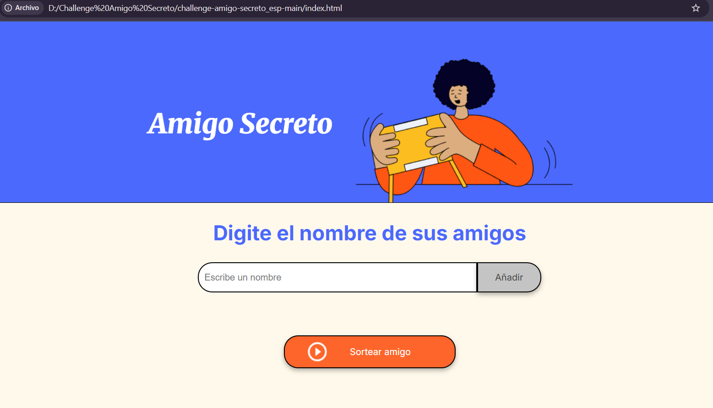

# 🎁 Amigo Secreto

Este proyecto es una aplicación web sencilla para organizar un sorteo de **Amigo Secreto**.  
Los usuarios pueden ingresar nombres de amigos en una lista y luego realizar un sorteo aleatorio para determinar quién será el “amigo secreto”.

## Funcionalidades

- **Agregar nombres**: El usuario ingresa un nombre y lo añade a la lista con el botón "Añadir".  
- **Validación de entrada**: Si el campo está vacío, aparece un mensaje de alerta pidiendo un nombre válido.  
- **Visualizar la lista**: Los nombres añadidos se muestran en una lista visible en la página.  
- **Sorteo aleatorio**: Al presionar "Sortear Amigo", se selecciona aleatoriamente uno de los nombres ingresados y se muestra el resultado en pantalla.  

### Pantalla principal

